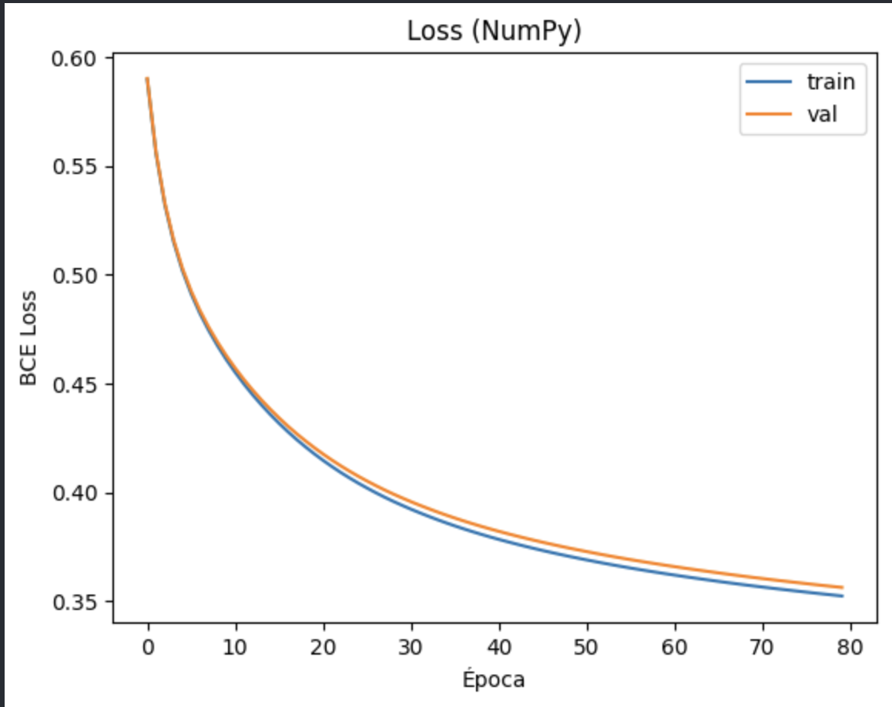
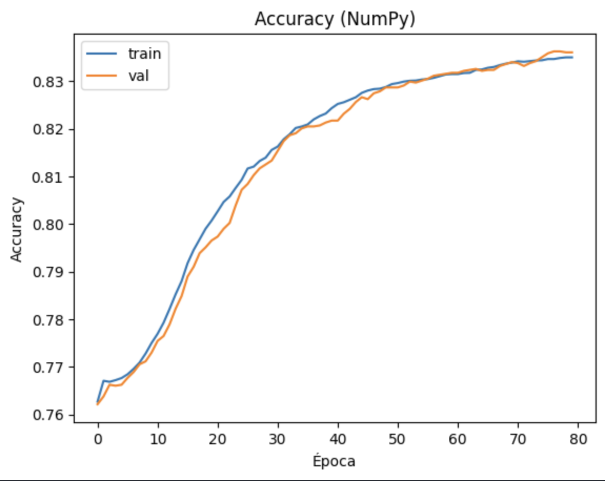
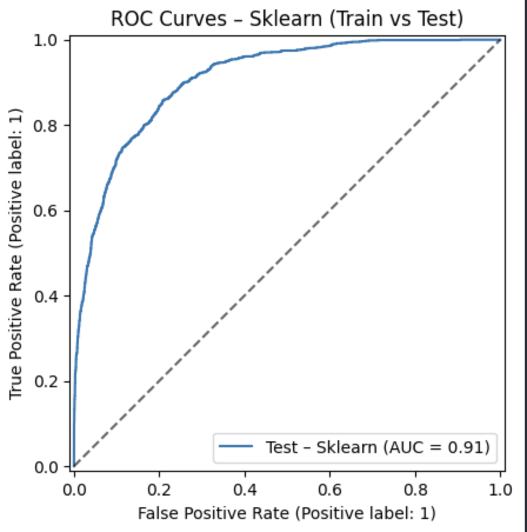
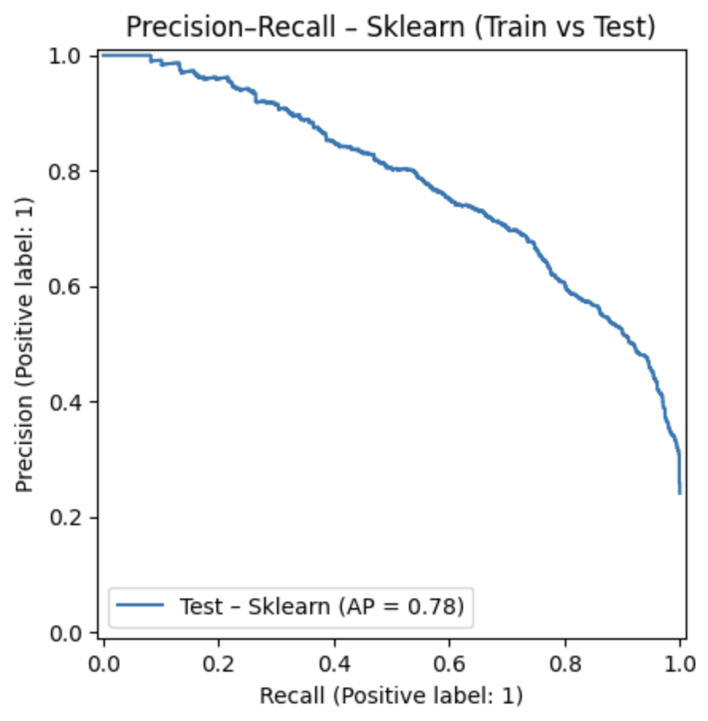

# MLP no Adult Income — Relatório

---

## 1) Objetivo

Neste projeto, buscamos prever se a renda anual de uma pessoa é **>50K** ou **<=50K** utilizando o conjunto **Adult Income**.  
Trata-se de um problema de **classificação binária** com amostra ampla (30k+ observações) e múltiplos atributos, majoritariamente categóricos.

- Não utilizamos datasets clássicos superexpostos (Titanic/Iris/Wine).
- Implementamos um **MLP em NumPy**.

---

## 2) Dados

**Variável-alvo (`income`)**: binária, mapeada para `{0,1}`.  
**Desbalanceamento**: aproximadamente **75%** para a classe `0` (<=50K) e **25%** para a classe `1` (>50K); portanto, o **baseline** da classe majoritária é ~**0,75** de acurácia.

**Atributos principais**
- **Numéricos**: `age`, `fnlwgt`, `education-num`, `capital-gain`, `capital-loss`, `hours-per-week`.
- **Categóricos**: `workclass`, `education`, `marital-status`, `occupation`, `relationship`, `race`, `sex`, `native-country`  
  (esta última apresenta diversas categorias raras, elevando o número de colunas após a codificação one-hot).

---

## 3) Preparação dos dados

Geramos **um único arquivo consolidado** — **`adult_clean.csv`** — pronto para modelagem. O pipeline aplicado foi:

1. Conversão de faltantes: substituímos `'?'` por `NaN` em colunas categóricas.  
2. Remoção de duplicatas e de linhas remanescentes com `NaN`.  
3. Tratamento de outliers em variáveis numéricas por **capping via IQR**  
   (limites: `Q1 − 1,5·IQR` e `Q3 + 1,5·IQR`).  
4. **Codificação one-hot** das variáveis categóricas (colunas binárias 0/1).  
5. **Padronização (z-score)** das numéricas (média 0, desvio 1), calculada manualmente (NumPy).

**Observações**
- Obtivemos **~105 colunas** após one-hot, especialmente devido a `native-country`.  
- O arquivo final não contém `NaN`, apresenta dummies binárias válidas e `income` em `{0,1}`.

---

## 4) Modelo: MLP (NumPy)

**Arquitetura**
- Camadas densas do tipo `entrada → [ocultas] → 1`.
- Ativações nas ocultas: **ReLU** (ou **tanh**); saída: **sigmoid**.
- **Função de perda**: Binary Cross-Entropy (BCE).  
- **Otimização**: mini-batch SGD, com opção de **L2**.  
- **Inicialização**: **He** (ReLU) e **Xavier** (demais).  
- **Backpropagation** implementado de forma vetorizada em **NumPy**.

---

## 5) Treinamento e Validação

**Protocolo**
- **Divisão estratificada**: **70%** treino, **15%** validação, **15%** teste.  
- **Padronização** ajustada no **treino** e aplicada a validação e teste.  
- **Early stopping** com monitoramento da **val loss** (paciência = 10) e restauração do melhor estado.  
- **Hiperparâmetros-base**: camadas ocultas `(128, 64)`, `lr = 1e-2`, `batch = 256`, `l2 = 1e-4`.

**Comportamento esperado**
- Redução consistente da perda em treino;  
- Métricas de validação próximas às de treino (pequeno “gap” sugere overfitting sob controle).

---

## 6) Curvas de aprendizado

- 
*Queda consistente da BCE; pouca diferença entre treino e validação → baixo overfitting.*

- 
*Accuracy de validação acompanha a de treino; ganhos marginais após ~40–50 épocas.*

**Leitura**  
As curvas tendem a apresentar queda acentuada nas primeiras épocas e estabilização posterior.  
Um distanciamento significativo entre treino e validação indica sobreajuste.

---

## 7) Avaliação (Teste)

**Baseline**: acurácia da classe majoritária ≈ **0,75**.

**Resultados típicos observados (Adult, `threshold = 0,5`)**
- **Accuracy** ≈ **0,84**  
- **Precision** ≈ **0,71**  
- **Recall** ≈ **0,60**  
- **F1** ≈ **0,65**  
- **Matriz de confusão** (TN, FP, FN, TP) ≈ `(3125, 271, 451, 676)`

**Interpretação**
- Superamos o baseline com margem confortável.  
- O compromisso entre precisão e recall é adequado para `threshold = 0,5`; ajustes de limiar podem privilegiar um ou outro conforme o custo de erros.

**Curvas ROC/PR**
-  
*AUC ≈ 0,91 → boa separação entre classes. Linha tracejada representa um classificador aleatório.*
e 
*AP ≈ 0,78. Em dados desbalanceados, a PR é mais informativa que a ROC; alta precisão para faixas de recall até ~0,6–0,7.*
  

---

## 8) Conclusões

- O MLP superou o **baseline** de 0,75, alcançando cerca de **0,84** de acurácia em teste, com **F1** competitivo.  
- Em dados desbalanceados, **F1** e **PR-AUC** complementam a leitura de **accuracy**.  
- O ajuste de **threshold** permite calibrar o compromisso **precisão vs. recall** conforme o custo de FP/FN.  
- Possibilidades de avanço incluem **pesos por classe** na BCE, **tuning** (número de camadas/neurônios, `lr`, `l2`), **agrupamento de categorias raras** (e.g., `native-country`) e, em bibliotecas, **dropout** e **batch normalization**.

---

## 9) Reprodutibilidade

1. Geramos **`adult_clean.csv`** (pipeline de preparação descrito na Seção 3).  
2. Realizamos **split estratificado** (70/15/15).  
3. Recalculamos o **z-score** com estatísticas do **treino** e aplicamos em validação e teste.  
4. Treinamos o MLP (NumPy) com **early stopping** e salvamos o melhor estado.  
5. Registramos histórico (CSV) e figuras (loss/acc, ROC/PR).  
6. Reportamos as métricas finais de **teste**.

